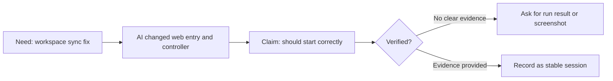

# VibeBrief

🌐 Languages: [English](README.md) | [中文](README.zh-CN.md)

> Turn AI coding sessions into clear briefs, visual summaries, and reusable project memory.

AI agents can write code, fix bugs, and explain what they changed.

But if you are not an engineer, the harder problem is:

- What actually happened in this coding session?
- Why did the AI make those changes?
- What does it mean for the project?
- What has been verified?
- What is still risky?
- How do I continue in the next chat?
- How do I turn this messy conversation into useful project memory?

VibeBrief helps non-engineers turn AI coding conversations into plain-language session briefs, milestone reports, visual summaries, and handoff-ready project memory.

## What Is VibeBrief

VibeBrief is a non-engineer-first AI coding briefing skill.

It does not write code for you. It turns messy AI coding conversations, code-change summaries, bug-fix notes, validation results, and key decisions into understandable project assets:

- Session briefs
- Milestone reports
- Mermaid visual summaries
- Decision and risk records
- Handoff packs for a new chat or another AI agent
- Local project memory under `docs/ai-worklog/`

## Who It Is For

VibeBrief is for people who use AI coding agents but do not want to manage a project through raw code diffs.

It is especially useful for:

- Non-engineers building with Claude Code, Codex, Cursor, OpenClaw, or other AI agents
- Product managers and solo founders
- Designers, operators, educators, and creators
- People building demos, internal tools, automations, or product prototypes with AI help
- Anyone who needs a clear project memory after the coding session ends

## Why AI Agent Summaries Are Not Enough

Most agent summaries answer: "What did I change?"

VibeBrief answers a different question: "What does this session mean for the project, what is verified, what is still risky, and how should the next AI continue?"

The difference matters because agent summaries are often technical, local to one chat, and weak at preserving decisions, risks, stage boundaries, and handoff context.

## Quick Navigation

- [30-Second Demo](#30-second-demo)
- [Try Without Installing](#try-without-installing)
- [Ask Claude Code / Codex To Install It](#ask-claude-code--codex-to-install-it)
- [Core Modes](#core-modes)
- [Examples](#examples)
- [Memory Structure](#memory-structure)
- [How It Differs From AskProof](#how-it-differs-from-askproof)
- [Installation](#installation)
- [Roadmap](#roadmap)

## 30-Second Demo

Paste an AI coding reply:

```text
I fixed the workspace window sync issue, changed demo_web_app.py and controller.py,
and it should start correctly now.
```

VibeBrief should turn it into:

- Session goal: Fix the workspace window sync issue.
- What the AI changed: It changed the web entry point and controller logic.
- Project meaning: This may improve the stability of the course workspace startup.
- Verified: The AI did not provide a clear run result, so this is unconfirmed.
- Risk: Without running `/workspace`, real usability is not proven.
- Next step: Ask for the startup command, run result, or screenshot.
- Next prompt: "Please run `/workspace` first and provide the result. Do not expand features until startup is verified."



## Try Without Installing

Copy this prompt into your AI coding agent:

```text
Act as VibeBrief, an AI coding briefing skill for non-engineers.
Turn the following AI coding conversation into a plain-language Session Brief.
Separate what was changed from what was verified. Do not invent evidence.
Include project meaning, current risks, next steps, and a copy-paste prompt for the next AI chat.
Use Mermaid if a simple diagram would help.

Conversation:
[paste the AI coding conversation here]
```

## Ask Claude Code / Codex To Install It

You can ask your coding agent to install this repository as a local skill:

```text
Please install the VibeBrief skill from this repository:
https://github.com/happiness9527/vibebrief-skill
Keep it as an independent skill named vibebrief.
Do not merge it into AskProof or rename any existing skill.
After installing, show me where the SKILL.md file was placed.
```

After publishing to GitHub, replace the URL with your actual repository if you fork this project.

For manual setup, copy the `vibebrief/` folder into the local skills directory used by your agent.

## What if `/vibebrief` is not recognized?

Some AI tools use different local skill directories, instruction folders, or command registration systems.

If `/vibebrief` is not recognized after installation, it does not mean VibeBrief cannot be used.

You can start with the [Try Without Installing](#try-without-installing) prompt mode, or ask your current AI tool to explain which local instruction or skill installation format it supports.

## Core Modes

| Mode | Use it when | Output |
| --- | --- | --- |
| Session Brief | A coding session just ended or you pasted an AI coding summary | Goal, actual work, project meaning, verified and unverified items, risks, next prompt |
| Milestone Report | A phase may be stable enough to preserve | Stage goal, completed capability, decisions, risks, next boundary |
| Handoff Pack | You are starting a new chat or switching agents | Project background, current status, traps to avoid, executable next prompt |
| Visual Summary | You want a diagram of what happened | Mermaid flowchart, roadmap, fix chain, risk map, or swimlane |
| Project Memory | You want to save the session locally | `docs/ai-worklog/` entries and an updated memory index |
| Acceptance Mode | The AI says something is fixed and you need confidence | Evidence, missing evidence, minimum acceptance action, next question |

## Examples

- [Session Brief example](vibebrief/examples/session-brief-example.md)
- [Milestone Report example](vibebrief/examples/milestone-report-example.md)
- [Handoff Pack example](vibebrief/examples/handoff-pack-example.md)
- [Visual Summary example](vibebrief/examples/visual-summary-example.md)
- [Project Memory example](vibebrief/examples/project-memory-example.md)
- [Acceptance Mode example](vibebrief/examples/acceptance-mode-example.md)

## Memory Structure

VibeBrief can help create local project memory when you ask it to save the session:

```text
docs/ai-worklog/
├── README.md
├── current-status.md
├── sessions/
├── milestones/
├── decisions/
├── risks/
├── handoff/
├── visuals/
└── index.json
```

V0.1 should generate the content first and ask before writing files. It should not silently write private project history.

## How It Differs From AskProof

AskProof is an independent "AI acceptance officer" skill. It focuses on what to ask when an AI says "done" and how to judge whether completion is proven.

VibeBrief does not replace AskProof.

VibeBrief focuses on the full AI coding process: briefing, stage reports, diagrams, project memory, and handoff continuity.

It includes a light Acceptance Mode only to keep briefs honest about what is modified, verified, unverified, and risky.

## Installation

1. Clone or download this repository.
2. Copy the `vibebrief/` directory into your AI agent's local skills directory.
3. Ask your agent to list available skills and confirm that `vibebrief` is available.
4. Try: "Help me summarize this coding session with VibeBrief."

Useful local checks:

```bash
python3 vibebrief/scripts/doctor.py
python3 -m py_compile vibebrief/scripts/*.py
```

## Roadmap

- V0.1: Session briefs, milestone reports, handoff packs, Mermaid summaries, local memory helpers, and light Acceptance Mode.
- Later: More examples, agent-specific install notes, richer memory indexing, and optional integrations.
- Not planned for V0.1: UI, background daemon, automatic commits, database service, Slack, Notion, or Lark integrations.

See [docs/roadmap.md](docs/roadmap.md) for details.

## License

MIT. See [LICENSE](LICENSE).

If VibeBrief helps you turn messy AI coding sessions into reusable project memory, consider starring the repo so more non-engineers can find it.
