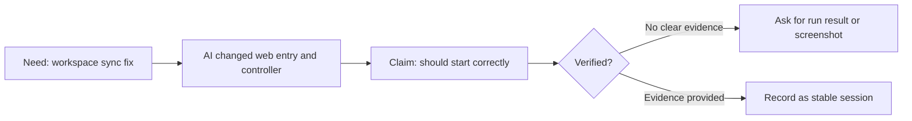

# VibeBrief

🌐 Languages: [English](README.md) | [中文](README.zh-CN.md)

> Turn AI coding sessions into clear briefs, visual summaries, and reusable project memory.

AI agents can write code, fix bugs, and explain what they changed.

But if you are not an engineer, the harder problem is staying oriented:

- What actually happened in this coding session?
- Why did the AI make those changes?
- What does it mean for the project?
- What has been verified?
- What is still risky?
- How do I continue in the next chat?
- How do I turn this messy conversation into useful project memory?

VibeBrief helps turn AI coding conversations into plain-language session briefs, handoff notes, visual summaries, and reusable project memory.

## What Is VibeBrief

VibeBrief is a non-engineer-first AI coding briefing skill.

It does not write code for you. It turns messy AI coding conversations into understandable project assets:

- Session briefs
- Milestone reports
- Mermaid visual summaries
- Decision and risk records
- Handoff packs for a new chat or another AI agent
- Local project memory under `docs/ai-worklog/`

## Who It Is For

VibeBrief is for people who use AI coding agents but do not want to manage a project through raw code diffs.

It is especially useful for:

- Non-engineers building with Claude Code, Codex, Cursor, OpenClaw, or other AI agents
- Product managers and solo founders
- Designers, operators, educators, and creators
- People building demos, internal tools, automations, or product prototypes with AI help
- Anyone who needs a clear project memory after the coding session ends

It is non-engineer-first, but also useful for developers or teams that need clearer AI coding records, handoffs, and project memory.

## Why It Exists

Most AI coding tools can summarize what they changed.

VibeBrief keeps the user-facing thread clearer: what happened, what is still uncertain, and how the next chat should continue.

## Quick Navigation

- [30-Second Demo](#30-second-demo)
- [Try Without Installing](#try-without-installing)
- [Ask Claude Code / Codex To Install It](#ask-claude-code--codex-to-install-it)
- [Core Modes](#core-modes)
- [Examples](#examples)
- [Memory Structure](#memory-structure)
- [What VibeBrief Is Not](#what-vibebrief-is-not)
- [Installation](#installation)
- [Roadmap](#roadmap)

## 30-Second Demo

Paste an AI coding reply:

```text
I fixed the workspace window sync issue, changed demo_web_app.py and controller.py,
and it should start correctly now.
```

VibeBrief should turn it into a short plain-language brief:

- The goal was to fix workspace startup behavior.
- The AI says it changed the web entry and controller.
- The result is still unconfirmed because no run output was shown.
- The next step is to ask for a startup check before adding features.



## Try Without Installing

Copy this prompt into your AI coding agent:

```text
Act as VibeBrief, an AI coding briefing skill for non-engineers.
Turn the following AI coding conversation into a plain-language session brief.
Separate confirmed from unconfirmed content and suggest the next step.

Conversation:
[paste the AI coding conversation here]
```

## Ask Claude Code / Codex To Install It

You can ask your coding agent to install this repository as a local skill:

```text
Please install the VibeBrief skill from this repository:
https://github.com/happiness9527/vibebrief-skill
Keep it as an independent skill named vibebrief.
Keep the directory name and skill name as vibebrief.
After installing, show me where the SKILL.md file was placed.
```

After publishing to GitHub, replace the URL with your actual repository if you fork this project.

For manual setup, copy the `vibebrief/` folder into the local skills directory used by your agent.

## What if `/vibebrief` is not recognized?

Some AI tools use different local skill directories, instruction folders, or command registration systems.

If `/vibebrief` is not recognized after installation, it does not mean VibeBrief cannot be used.

If `/vibebrief` returns `Unknown command` after installation, fully exit and restart Claude Code. Newly installed local skills are usually detected in a new session.

You can start with the [Try Without Installing](#try-without-installing) prompt mode, or ask your current AI tool to explain which local instruction or skill installation format it supports.

## Using `/vibebrief`

If you enter only `/vibebrief`, VibeBrief should show a simple mode menu:

1. Session Brief (recommended default): help me understand what the AI did in this coding session
2. Confidence Check: help me judge whether the AI's "fixed" or "done" claim is actually supported
3. Handoff Pack: prepare a new-chat handoff so the next AI can continue safely
4. Milestone Report: decide whether this session is stable enough to count as a project checkpoint
5. Visual Summary: show the flow, risk, or fix chain with a simple Mermaid diagram
6. Project Memory: turn this session into save-ready project memory

If unsure, choose 1.

If you enter `/vibebrief` with an AI coding conversation, logs, terminal output, or a natural-language request, VibeBrief should infer the intent automatically instead of forcing the menu.

## Core Modes

| Mode | Use it when | Typical output |
| --- | --- | --- |
| Session Brief | A coding session just ended or you pasted an AI coding summary | A short explanation of what happened and what to do next |
| Milestone Report | A phase may be stable enough to preserve | A lightweight stage review |
| Handoff Pack | You are starting a new chat or switching agents | A compact new-chat context package |
| Visual Summary | You want a diagram of what happened | A simple Mermaid diagram and explanation |
| Project Memory | You want to save the session locally | Save-ready notes for `docs/ai-worklog/` |
| Confidence Check | The AI says something is fixed and you need confidence | A lightweight check of claim, evidence, and remaining uncertainty |

## Examples

- [Session Brief example](vibebrief/examples/session-brief-example.md)
- [Milestone Report example](vibebrief/examples/milestone-report-example.md)
- [Handoff Pack example](vibebrief/examples/handoff-pack-example.md)
- [Visual Summary example](vibebrief/examples/visual-summary-example.md)
- [Project Memory example](vibebrief/examples/project-memory-example.md)
- [Confidence Check example](vibebrief/examples/acceptance-mode-example.md)

## Memory Structure

VibeBrief can help create local project memory when you ask it to save the session:

```text
docs/ai-worklog/
├── README.md
├── current-status.md
├── sessions/
├── milestones/
├── decisions/
├── risks/
├── handoff/
├── visuals/
└── index.json
```

V0.1 should generate the content first and ask before writing files. It should not silently write private project history.

## What VibeBrief Is Not

VibeBrief is not a coding tool, a code review tool, or an automated acceptance system that replaces human judgment.

Its core job is to make AI coding work easier to understand, review, hand off, and preserve.

Acceptance Mode is a lightweight confidence check inside VibeBrief. It helps distinguish claimed changes from verified results.

## Installation

1. Clone or download this repository.
2. Copy the `vibebrief/` directory into your AI agent's local skills directory.
3. Ask your agent to list available skills and confirm that `vibebrief` is available.
4. Try: "Help me summarize this coding session with VibeBrief."

Useful local checks:

```bash
python3 vibebrief/scripts/doctor.py
python3 -m py_compile vibebrief/scripts/*.py
```

## Roadmap

- V0.1: Session briefs, milestone reports, new-chat handoff packs, Mermaid summaries, local memory helpers, and confidence checks.
- Later: More lightweight examples, agent-specific install notes, and clearer compatibility guidance.
- Not planned for V0.1: UI, background daemon, automatic commits, database service, or third-party integrations.

See [docs/roadmap.md](docs/roadmap.md) for details.

## License

MIT. See [LICENSE](LICENSE).

If VibeBrief helps you turn messy AI coding sessions into reusable project memory, consider starring the repo so more non-engineers can find it.
