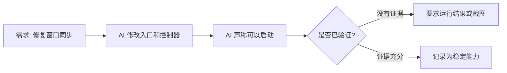

# VibeBrief｜AI 开发过程简报 Skill

🌐 语言：[English](README.md) | [中文](README.zh-CN.md)

> 把 AI 开发过程，变成你看得懂、接得上、可复盘的项目资产。

AI 会写代码，也会告诉你“我改了什么”。

但如果你不是工程师，真正困难的是：

- 这轮 AI 到底做了什么？
- 为什么这么做？
- 对项目意味着什么？
- 哪些已经验证？
- 哪些还没验证？
- 下次新开对话怎么接上？
- 怎么把这段杂乱对话沉淀成项目资料？

VibeBrief 是一个面向非工程师的 AI Coding 过程简报 Skill。

它会把 AI 开发对话、代码修改、问题修复、验证结果和关键决策，整理成你能看懂的：

- 本轮开发简报
- 阶段总结报告
- 可视化流程图
- 风险和决策记录
- 新对话交接包
- 本地项目记忆

## VibeBrief 是什么

VibeBrief 不是写代码工具，也不是代码审查工具。

它的作用是把 AI coding 过程翻译成普通人能长期理解和复盘的项目资料。它会解释本轮目标、AI 实际做了什么、为什么这么做、对产品意味着什么、哪些已经验证、哪些还只是 AI 声称完成。

## 适合谁使用

VibeBrief 适合正在用 AI 辅助开发，但不想长期陷在代码细节里的人：

- 非工程师
- 产品经理
- 一人公司创业者
- 设计师、运营、内容创作者
- 教育产品负责人
- 使用 Claude Code、Codex、Cursor、OpenClaw 或国内 Agent 平台搭产品的人
- 需要把 AI 开发过程沉淀成项目资料的人

它优先服务非工程师，但同样适合需要整理 AI coding 过程、交接上下文和沉淀项目记忆的开发者或团队成员。

## 为什么 AI 自带总结还不够

AI Agent 自带总结通常回答：“我改了什么。”

VibeBrief 更关心：“这轮开发在整个项目中意味着什么，哪些已验证，哪些有风险，下轮 AI 怎么接上。”

它会把单次对话里的零散信息沉淀成稳定的过程文档，包括阶段报告、决策记录、风险记录、可视化流程图和交接包。

## 快速导航

- [30 秒体验](#30-秒体验)
- [不安装也能先试](#不安装也能先试)
- [让 Claude Code / Codex 帮你安装](#让-claude-code--codex-帮你安装)
- [核心模式](#核心模式)
- [示例](#示例)
- [本地记忆目录](#本地记忆目录)
- [VibeBrief 不是什么](#vibebrief-不是什么)
- [安装方式](#安装方式)
- [路线图](#路线图)

## 30 秒体验

你粘贴一段 AI coding 回复：

```text
我修复了 workspace 的窗口同步问题，修改了 demo_web_app.py 和 controller.py，
现在应该可以正常启动。
```

VibeBrief 应该输出：

- 本轮目标：修复工作台窗口同步问题；
- AI 实际做了什么：修改 Web 入口和控制器；
- 项目意义：提升课程窗口启动稳定性；
- 已验证：AI 未提供明确运行证据，暂记为未确认；
- 风险：如果没有运行 `/workspace`，不能确认真实可用；
- 下一步：要求 AI 提供启动命令、运行结果或截图；
- 下一轮 Prompt：请先运行 `/workspace` 并提供结果，不要继续扩展功能；
- Mermaid 流程图：需求 → 修改 → 待验证 → 下一步。



## 不安装也能先试

把下面这段话复制给你的 AI coding 工具：

```text
请扮演 VibeBrief，一个面向非工程师的 AI 开发简报 Skill。
请把下面这段 AI coding 对话整理成本轮开发简报。
必须区分“已经修改”和“已经验证”，不能编造证据。
请说明项目意义、当前风险、下一步建议，并给出下一轮 AI 可复制 Prompt。
如果适合，请用 Mermaid 画一个简单流程图。

对话内容：
[粘贴 AI coding 对话]
```

## 让 Claude Code / Codex 帮你安装

你可以把这个仓库交给 AI coding 工具，并要求它安装：

```text
请从这个仓库安装 VibeBrief 本地 Skill：
https://github.com/happiness9527/vibebrief-skill
Skill 名称保持为 vibebrief。
请保持目录名和 Skill 名称为 vibebrief，安装完成后告诉我 SKILL.md 被放在哪里。
```

如果你 fork 了本项目，请把上面的 URL 替换成你的实际仓库地址。

手动安装时，把 `vibebrief/` 目录复制到你的 Agent 使用的本地 skills 目录即可。

## 如果 /vibebrief 不识别怎么办？

有些 AI 工具的本地 Skill 目录、指令目录或命令注册方式不同。

如果安装后 `/vibebrief` 没有被识别，不代表 VibeBrief 不能用。你可以先使用 [不安装也能先试](#不安装也能先试) 的 Prompt 模式，或者让当前 AI 工具说明它支持的本地指令 / Skill 安装方式。

## 核心模式

| 模式 | 什么时候用 | 输出什么 |
| --- | --- | --- |
| Session Brief｜本轮开发简报 | 本轮 coding 刚结束，或你看不懂 AI 做了什么 | 目标、实际改动、项目意义、已验证、未验证、风险、下一轮 Prompt |
| Milestone Report｜阶段总结报告 | 你不确定这轮是否算阶段节点 | 阶段目标、已完成能力、关键决策、风险、下一阶段边界 |
| Handoff Pack｜新对话交接包 | 你要新开对话或换 AI | 项目背景、当前状态、未解决问题、避坑事项、可执行 Prompt |
| Visual Summary｜可视化总结 | 你想用图理解流程 | Mermaid 流程图、路线图、修复链路图、风险图或泳道图 |
| Project Memory｜项目记忆写入 | 你想保存本轮过程 | `docs/ai-worklog/` 内容和索引 |
| Acceptance Mode｜轻量验收模式 | AI 说修好了，你想知道是否可信 | 完成可信度、已有证据、缺失证据、最小验收动作、追问 Prompt |

## 示例

- [本轮开发简报示例](vibebrief/examples/session-brief-example.md)
- [阶段总结报告示例](vibebrief/examples/milestone-report-example.md)
- [新对话交接包示例](vibebrief/examples/handoff-pack-example.md)
- [可视化总结示例](vibebrief/examples/visual-summary-example.md)
- [项目记忆写入示例](vibebrief/examples/project-memory-example.md)
- [轻量验收模式示例](vibebrief/examples/acceptance-mode-example.md)

## 本地记忆目录

当你要求“保存这轮总结”时，VibeBrief 第一版应先生成内容并询问是否写入。默认目录是：

```text
docs/ai-worklog/
├── README.md
├── current-status.md
├── sessions/
├── milestones/
├── decisions/
├── risks/
├── handoff/
├── visuals/
└── index.json
```

## VibeBrief 不是什么

VibeBrief 不是写代码工具，也不是代码审查工具，更不是用来替代开发者判断的自动验收系统。

它的核心作用是把一次 AI coding 对话整理成非工程师也能看懂、能复盘、能交接的项目过程资料。

它重点回答：

- 这轮 AI 到底做了什么；
- 哪些只是 AI 声称完成；
- 哪些已经有验证证据；
- 当前项目风险是什么；
- 下一轮对话应该怎么继续；
- 哪些内容值得沉淀为项目记忆。

轻量验收模式只是 VibeBrief 内置的可信度检查能力，用于区分“已修改”、“已验证”和“仍有风险”，不依赖任何其他 Skill。

## 安装方式

1. 克隆或下载本仓库。
2. 把 `vibebrief/` 目录复制到你的 AI Agent 本地 skills 目录。
3. 让 Agent 确认 `vibebrief` 已可用。
4. 试一句：“用 VibeBrief 帮我总结这轮开发。”

本地检查命令：

```bash
python3 vibebrief/scripts/doctor.py
python3 -m py_compile vibebrief/scripts/*.py
```

## 路线图

- V0.1：本轮开发简报、阶段总结、交接包、Mermaid 可视化、本地记忆辅助脚本、轻量验收模式。
- 后续：更多 Agent 安装说明、更丰富的索引和示例、可选集成。
- V0.1 暂不做：前端 UI、后台守护进程、自动 commit、数据库、飞书、Notion、Slack。

详见 [docs/roadmap.md](docs/roadmap.md)。

## 开源协议

MIT。详见 [LICENSE](LICENSE)。

如果 VibeBrief 帮你把杂乱的 AI 开发过程沉淀成可复用的项目资料，欢迎给这个项目一个 Star，让更多非工程师看到它。
