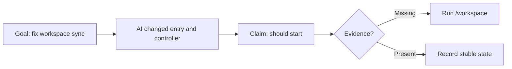

# After VibeBrief

## Session Brief

**Current stage:** Bug fix and stabilization.

**Session goal:** Fix the workspace window sync problem.

**What the AI actually did:**

- It changed the web app entry point.
- It changed the controller that coordinates workspace window behavior.

**Project meaning:**

- If verified, this makes the main DemoDesk workspace startup more reliable.

**Verified:**

- Unconfirmed. No command output, screenshot, or test result was provided.

**Risk:**

- The AI used "should", so the fix is not proven.

**Next step:**

- Run `/workspace` and show the result before adding new features.

**Prompt for the next AI:**

```text
Please verify the DemoDesk workspace window sync fix.
Run `/workspace`, show the exact result, and state what remains untested.
Do not add new features until startup is verified.
```


