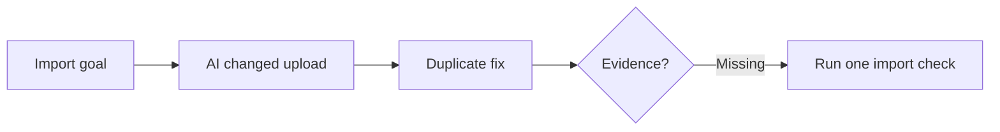

# Visual Summary Example

## Input

Fictional project: SoloCRM.

```text
The AI added contact import, fixed duplicate detection, and said the upload flow works.
No test output was shown.
```

## Possible VibeBrief Output



The work may improve contact import, but the upload flow is still unconfirmed because no evidence was shown.
