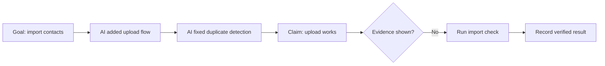

# Visual Summary Example

## Input

Fictional project: SoloCRM.

```text
The AI added contact import, fixed duplicate detection, and said the upload flow works.
No test output was shown.
```

## VibeBrief Output



In plain language:

- The work moved SoloCRM toward contact import.
- The duplicate detection fix is important because bad imports can pollute the contact list.
- The upload flow is still unverified because no test result or screenshot was shown.
- The next step is not to add more CRM features. The next step is to prove that one contact import works.

**Prompt for the next AI:**

```text
Please verify the SoloCRM contact import flow.
Use one small sample CSV, show the import result, and confirm duplicate handling.
Do not add new CRM features until this flow is verified.
```
