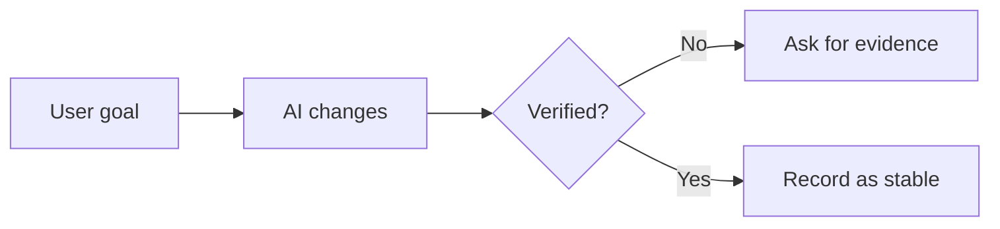

# Output Templates

Use these templates when the user needs a structured VibeBrief artifact.

## Session Brief

````markdown
## Session Brief

**Current stage:** ...

**Session goal:** ...

**What the AI actually did:**
- ...

**Why this matters for the project:**
- ...

**Key files or modules:**
- `path`: plain-language meaning

**Verified:**
- ...

**Unverified:**
- ...

**Risks:**
- ...

**Next step:**
- ...

**Prompt for the next AI:**
```text
...
```
````

## Milestone Report

````markdown
## Milestone Report

**Milestone name:** ...
**Stage goal:** ...

**Completed capability:**
- ...

**Key decisions:**
- ...

**Stable today:**
- ...

**Verified:**
- ...

**Open risks:**
- ...

**Snapshot recommendation:** Save / Do not save / Unconfirmed

**Next-stage boundary:**
- ...

**Do not expand yet:**
- ...

**Prompt for the next AI:**
```text
...
```
````

## Handoff Pack

````markdown
## Handoff Pack

**Project background:** ...
**Current goal:** ...
**Current status:** ...

**Recently completed:**
- ...

**Unresolved issues:**
- ...

**Key decisions:**
- ...

**Known risks:**
- ...

**Do not repeat these mistakes:**
- ...

**Prompt for the next AI:**
```text
...
```
````

## Acceptance Mode

````markdown
## Acceptance Check

**Completion confidence:** High / Medium / Low / Unconfirmed

**What appears changed:**
- ...

**Evidence available:**
- ...

**Evidence missing:**
- ...

**Minimum acceptance action:**
- ...

**Should continue?** Yes / Not yet / Unconfirmed

**Next question to ask the AI:**
```text
...
```
````

## Visual Summary

Always include Mermaid plus plain-language explanation:

````markdown


In plain language: ...
````
