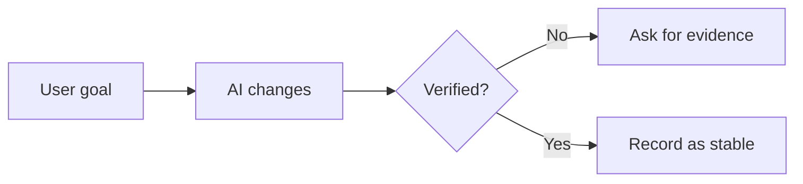

# Output Templates

Use these templates when the user needs a structured VibeBrief artifact.

## Bare `/vibebrief` Menu

Use this only when the user enters `/vibebrief` without content or a clear task.

Chinese:

```text
请选择你想让 VibeBrief 做什么：

1. 本轮开发简报（默认推荐）：我想看懂这轮 AI 到底做了什么
2. 可信度检查：AI 说修好了，我想判断是否真的可靠
3. 新对话交接包：我要换新 chat，希望下一轮能接上
4. 阶段报告：我想判断这轮是否可以作为一个阶段节点
5. 可视化流程图：我想用图看懂流程、风险或修复链路
6. 项目记忆保存：我想把这轮结果整理成可保存的项目资料

如果不确定，直接选 1。
```

English:

```text
What would you like VibeBrief to do?

1. Session Brief (recommended default): help me understand what the AI did in this coding session
2. Confidence Check: help me judge whether the AI's "fixed" or "done" claim is actually supported
3. Handoff Pack: prepare a new-chat handoff so the next AI can continue safely
4. Milestone Report: decide whether this session is stable enough to count as a project checkpoint
5. Visual Summary: show the flow, risk, or fix chain with a simple Mermaid diagram
6. Project Memory: turn this session into save-ready project memory

If unsure, choose 1.
```

## Session Brief

````markdown
## Session Brief

**Current stage:** ...

**Session goal:** ...

**What the AI actually did:**
- ...

**Why this matters for the project:**
- ...

**Key files or modules:**
- `path`: plain-language meaning

**Verified:**
- ...

**Unverified:**
- ...

**Risks:**
- ...

**Next step:**
- ...

**Prompt for the next AI:**
```text
...
```
````

## Milestone Report

````markdown
## Milestone Report

**Milestone name:** ...
**Stage goal:** ...

**Completed capability:**
- ...

**Key decisions:**
- ...

**Stable today:**
- ...

**Verified:**
- ...

**Open risks:**
- ...

**Snapshot recommendation:** Save / Do not save / Unconfirmed

**Next-stage boundary:**
- ...

**Do not expand yet:**
- ...

**Prompt for the next AI:**
```text
...
```
````

## Handoff Pack

````markdown
## Handoff Pack

**Project background:** ...
**Current goal:** ...
**Current status:** ...

**Recently completed:**
- ...

**Unresolved issues:**
- ...

**Key decisions:**
- ...

**Known risks:**
- ...

**Do not repeat these mistakes:**
- ...

**Prompt for the next AI:**
```text
...
```
````

## Acceptance Mode

````markdown
## Acceptance Check

**Completion confidence:** High / Medium / Low / Unconfirmed

**What appears changed:**
- ...

**Evidence available:**
- ...

**Evidence missing:**
- ...

**Minimum acceptance action:**
- ...

**Should continue?** Yes / Not yet / Unconfirmed

**Next question to ask the AI:**
```text
...
```
````

## Visual Summary

Always include Mermaid plus plain-language explanation:

````markdown


In plain language: ...
````
