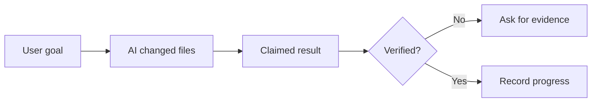
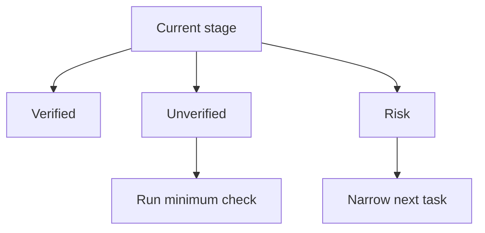
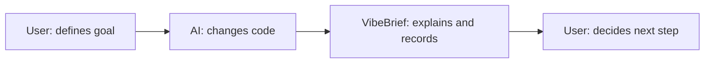

# Visual Summary Rules

Visual Summary uses Mermaid to make a coding session or stage understandable.

## Allowed Diagram Types

Use at least one:

- Task flowchart
- Stage roadmap
- Bug-fix chain
- Risk status map
- Human-AI collaboration swimlane

## Style Rules

- Keep labels short and plain.
- Avoid deep engineering internals unless the user asks.
- Show verification state when relevant.
- After the diagram, explain it in simple language.
- If the diagram would expose private names, generalize them.

## Example Patterns

### Task Flow

### Risk Map

### Collaboration Swimlane

